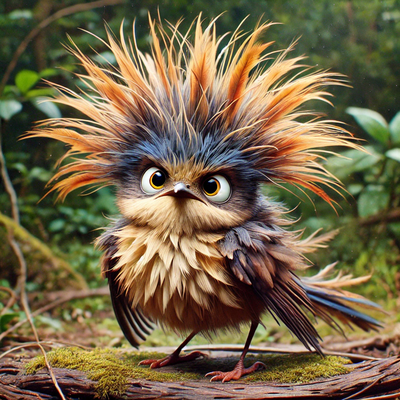

# mastodon-image-bot
A Mastodon bot that auto posts images from the OpenAI API.

The reason it frequently references birds is that I created it as a POC to post cute birds on a regular interval. An updated version of this code now provides a bird that celebrates occasional US Holidays and Observances!

Along with posting to Mastodon on a regular basis, it also sends an email as defined in the Environmental variables.

I have this set to run every day at 9AM. If it runs off-cycle, it'll still make a post but it'll wait until the following 9AM to post again. If it encounters an error, it'll log the error and wait before posting again to prevent draining your account.